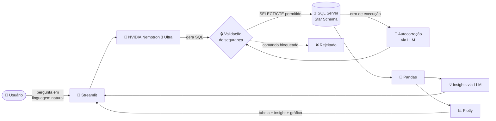

# Agente de IA para Análise de Vendas

Agente de IA que traduz perguntas de negócio em português para SQL validado,
executa contra um Data Warehouse dimensional (Star Schema) e devolve tabela
+ visualização automaticamente — sem que o usuário escreva uma linha de SQL.

Em vez de esperar um analista rodar uma query, qualquer pessoa da empresa
pergunta em linguagem natural — *"Qual o total de vendas líquidas por mês
em 2019?"* — e recebe a resposta pronta, com gráfico, em segundos.

## Arquitetura



- **Interface**: Streamlit (chat)
- **LLM**: NVIDIA NIM — `nvidia/nemotron-3-ultra-550b-a55b`, usado tanto para gerar SQL quanto para gerar insights sobre o resultado
- **Banco**: SQL Server, modelo dimensional (fato + dimensões)
- **Camada de segurança**: whitelist de tabelas/colunas + validação de SQL antes da execução (bloqueia `INSERT`, `UPDATE`, `DELETE`, `DROP` etc. — apenas `SELECT` e `WITH` (CTE) são permitidos)
- **Autocorreção**: se a query gerada falhar na execução (erro de sintaxe, alias inválido), o erro é enviado de volta ao modelo para correção automática, até 2 tentativas

## Modelo de dados

**Fato:**
- `F_VENDAS` — quantidade, venda bruta, desconto, venda líquida, por data/cliente/produto/vendedor/empresa

**Dimensões:**
- `D_CLIENTE`, `D_EMPRESA`, `D_PRODUTO`, `D_VENDEDOR`

## Como rodar localmente

### 1. Pré-requisitos

- Python 3.10+
- SQL Server acessível com o Star Schema populado
- Chave de API da NVIDIA NIM ([build.nvidia.com](https://build.nvidia.com))

### 2. Clonar e instalar dependências

```bash
git clone https://github.com/SEU-USUARIO/ai-agente-vendas.git
cd ai-agente-vendas
python -m venv venv
venv\Scripts\activate          # Windows
# source venv/bin/activate     # Linux/Mac
pip install -r requirements.txt
```

### 3. Configurar variáveis de ambiente

Copie `.env.example` para `.env` e preencha com seus valores:

```bash
copy .env.example .env
```

```
NVIDIA_API_KEY=sua_chave_aqui
SQL_CONNECTION_STRING=sua_connection_string_aqui
```

### 4. Rodar

```bash
streamlit run app.py
```

Acesse `http://localhost:8501` no navegador.

## Estrutura do projeto

```
├── app.py              # Interface Streamlit (chat)
├── agent_core.py        # Lógica do agente: schema, NVIDIA (Nemotron), execução SQL, insights, gráficos
├── notebook.ipynb       # Desenvolvimento e testes exploratórios
├── requirements.txt
├── .env.example
└── README.md
```

## Segurança

- Todo SQL gerado pelo LLM passa por validação antes de ser executado: apenas comandos `SELECT`, apenas tabelas/colunas da whitelist definida em `ALLOWED_TABLES`.
- Comandos destrutivos (`INSERT`, `UPDATE`, `DELETE`, `DROP`, `ALTER`, etc.) são bloqueados independentemente do que o modelo gerar.

## Roadmap

- [ ] Cache de perguntas frequentes
- [ ] Deploy em produção (Streamlit Community Cloud)
- [ ] Testes automatizados para `is_safe_sql`

## Autor

Roberto Souza (Beto) — BI Data Analyst & Analytics Engineer
